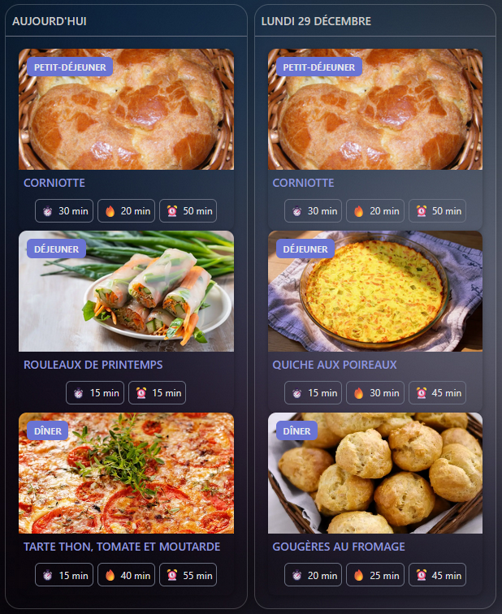
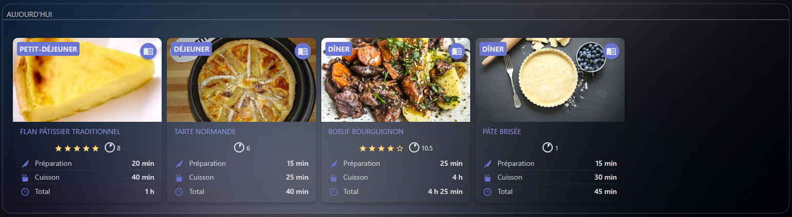
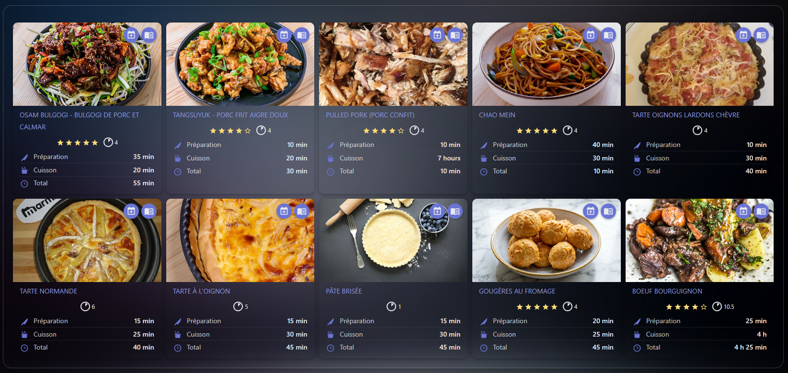
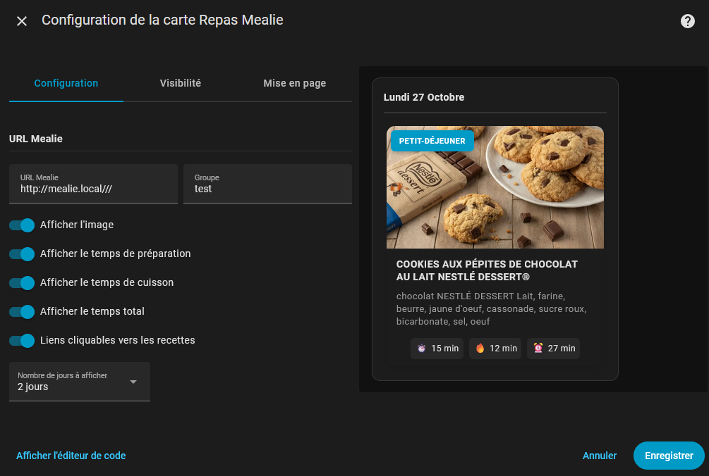
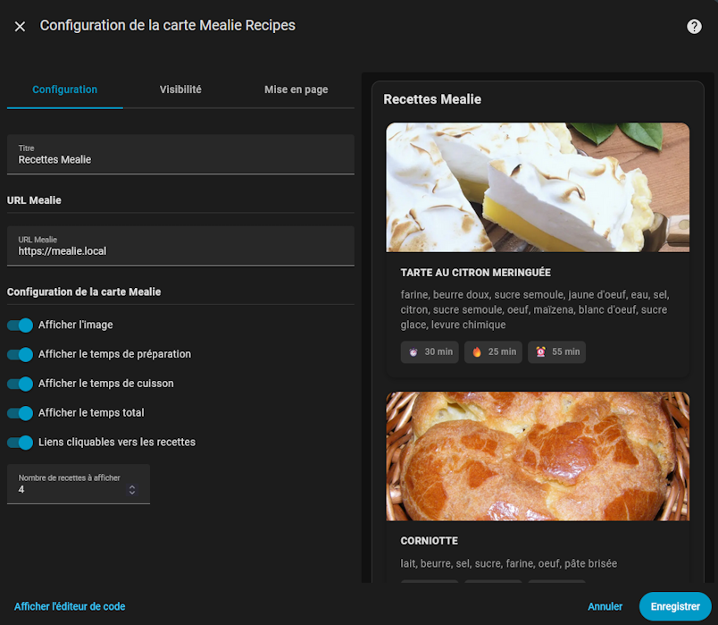

# Cartes Mealie

[](https://github.com/custom-components/hacs)
[](https://github.com/domodom30/mealie-card/releases)

Collection de 2 cartes Lovelace personnalisées pour afficher vos recettes et plans de repas Mealie dans Home Assistant.

## Cartes Disponibles

Ce package comprend **deux cartes distinctes** :

### 🍽️ Mealie Carte Repas
Affiche votre plan de repas par jours organisé par date et type de repas.

 

### 📚 Mealie Carte Recettes
Affiche une liste de vos recettes Mealie avec recherche intégrée.



## Fonctionnalités

- 📅 **Plan de repas** - Visualisez vos repas planifiés
- 🕒 **Types de repas** - Organisation par petit-déjeuner, déjeuner, dîner, etc.
- 📖 **Liste de recettes** - Parcourez vos recettes Mealie
- ➕ **Ajouter au repas** - Bouton pour planifier rapidement une recette
- 🖼️ **Images** - Affichage optionnel des images (proxy automatique pour les installations legacy)
- ⭐ **Notation** - Affichage des étoiles de notation des recettes
- 🍽️ **Portions** - Affichage du nombre de portions et de la quantité de production
- ⏱️ **Temps de préparation** - Affichage des temps de préparation, cuisson et total
- 🖱️ **Dialog recette** - Clic sur une recette ouvre un dialog détaillé (ingrédients, instructions)
- 🎨 **Éditeur visuel** - Configuration complète via l'interface graphique de Home Assistant
- 🌐 **Multilingue** - Support EN/FR/DE/ES/IT/NL/PL/PT/PT-BR/DA/RO (11 langues)


## Installation

### HACS (Recommandé)

1. Ouvrez HACS dans Home Assistant
2. Allez dans "Frontend"
3. Cliquez sur le bouton "+" en bas à droite
4. Recherchez "Mealie Card"
5. Cliquez sur "Installer"
6. Redémarrez Home Assistant

### Installation Manuelle

1. Téléchargez le fichier `mealie-card.js` depuis la [dernière release](https://github.com/domodom30/mealie-card/releases)
2. Copiez ce fichier dans votre dossier `config/www/`
3. Ajoutez la ressource dans Home Assistant :
   - Allez dans **Paramètres** → **Tableaux de bord** → **Ressources**
   - Cliquez sur **Ajouter une ressource**
   - URL : `/local/mealie-card.js`
   - Type : **Module JavaScript**
4. Redémarrez Home Assistant

## Prérequis

- **Home Assistant 2025.1.0** ou supérieur
- **Intégration Mealie** configurée dans Home Assistant
- Une instance **Mealie** fonctionnelle

> **Important** : Ces cartes nécessitent que l'intégration Mealie soit installée et configurée dans Home Assistant. Utilisez `config_entry_id` pour relier la carte à votre intégration.

## Configuration

### Éditeur Visuel

Les deux cartes disposent d'un **éditeur visuel complet**. Cliquez sur ✏️ (modifier) dans l'interface Lovelace pour accéder à la configuration graphique sans écrire de YAML.

---

### 🍽️ Carte Repas

Affiche votre plan de repas pour aujourd'hui et/ou les prochains jours.



#### Configuration Complète

```yaml
type: custom:mealie-mealplan-card
config_entry_id: <votre_entry_id>
day_offset: 0
show_image: true
show_rating: true
show_servings: true
show_description: true
show_prep_time: true
show_perform_time: true
show_total_time: true
layout: vertical
recipes_layout: horizontal
```

#### Options de Configuration

| Option | Type | Requis | Défaut | Description |
|--------|------|--------|--------|-------------|
| `type` | string | Oui | - | `custom:mealie-mealplan-card` |
| `config_entry_id` | string | Oui | - | ID de l'entrée de configuration de l'intégration Mealie |
| `url` | string | Non | - | URL de votre instance Mealie — uniquement si les images sont des hashes (legacy) |
| `day_offset` | number | Non | `0` | Décalage en jours (0 = aujourd'hui, 1 = demain, etc.) |
| `show_image` | boolean | Non | `false` | Afficher les images des recettes |
| `show_rating` | boolean | Non | `false` | Afficher la notation (étoiles) des recettes |
| `show_servings` | boolean | Non | `false` | Afficher le nombre de portions et la quantité de production |
| `show_description` | boolean | Non | `false` | Afficher la description des recettes |
| `show_prep_time` | boolean | Non | `true` | Afficher le temps de préparation |
| `show_perform_time` | boolean | Non | `true` | Afficher le temps de cuisson |
| `show_total_time` | boolean | Non | `true` | Afficher le temps total |
| `layout` | string | Non | `vertical` | Disposition de la carte (`vertical` ou `horizontal`) |
| `recipes_layout` | string | Non | `vertical` | Disposition des recettes dans la carte (`vertical` ou `horizontal`) |

---

### 📚 Carte Recette

Affiche une liste de vos recettes Mealie avec recherche intégrée.



#### Configuration Complète

```yaml
type: custom:mealie-recipe-card
config_entry_id: <votre_entry_id>
result_limit: 100
show_image: true
show_rating: true
show_servings: true
show_description: true
show_prep_time: true
show_perform_time: true
show_total_time: true
```

#### Options de Configuration

| Option | Type | Requis | Défaut | Description |
|--------|------|--------|--------|-------------|
| `type` | string | Oui | - | `custom:mealie-recipe-card` |
| `config_entry_id` | string | Oui | - | ID de l'entrée de configuration de l'intégration Mealie |
| `url` | string | Non | - | URL de votre instance Mealie — uniquement si les images sont des hashes (legacy) |
| `result_limit` | number | Non | `10` | Nombre maximum de recettes à afficher |
| `show_image` | boolean | Non | `false` | Afficher les images des recettes |
| `show_rating` | boolean | Non | `false` | Afficher la notation (étoiles) des recettes |
| `show_servings` | boolean | Non | `false` | Afficher le nombre de portions et la quantité de production |
| `show_description` | boolean | Non | `false` | Afficher la description des recettes |
| `show_prep_time` | boolean | Non | `true` | Afficher le temps de préparation |
| `show_perform_time` | boolean | Non | `true` | Afficher le temps de cuisson |
| `show_total_time` | boolean | Non | `true` | Afficher le temps total |

---

### Image Proxy (Installations legacy)

Si votre intégration Mealie fournit des identifiants d'images sous forme de hash (ancienne version), configurez l'option `url` avec l'URL de votre instance Mealie. La carte détecte automatiquement ce cas et l'éditeur affiche le champ uniquement si nécessaire.

```yaml
url: https://mealie.mondomaine.com
```

### Obtenir de l'Aide

Si vous rencontrez des problèmes :

- 🐛 [Signaler un bug](https://github.com/domodom30/mealie-card/issues/new?template=bug_report.md)
- 💡 [Demander une fonctionnalité](https://github.com/domodom30/mealie-card/issues/new?template=feature_request.md)
