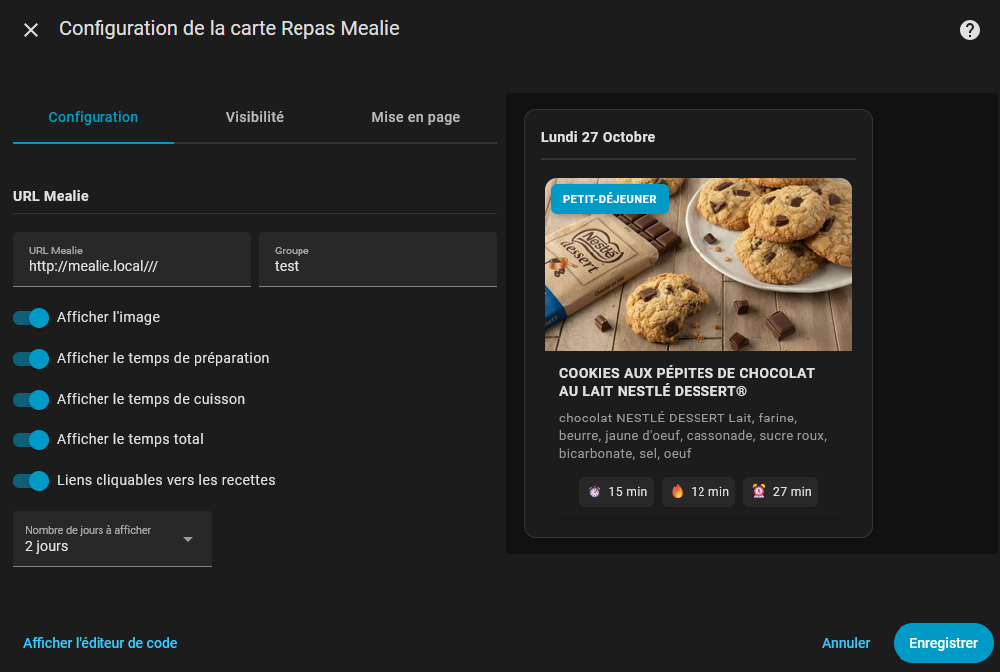

# Mealie Cards

[](https://github.com/custom-components/hacs)
[](https://github.com/domodom30/mealie-card/releases)

Collection of 2 custom Lovelace cards to display your Mealie recipes and meal plans in Home Assistant.

## Available Cards

This package includes **two distinct cards**:

### 🍽️ Mealie Meal Card
Displays your meal plan organized by date and meal type.

 

### 📚 Mealie Recipe Card
Displays a list of your Mealie recipes.


## Features

- 📅 **Meal Plan** - View your planned meals
- 🕒 **Meal Types** - Organization by breakfast, lunch, dinner, etc.
- 📖 **Recipe List** - Browse your Mealie recipes
- ➕ **Add to Meal** - Button to quickly plan a recipe
- 🖼️ **Images** - Optional image display
- ⏱️ **Preparation Time** - Display prep, cooking, and total time
- 🔗 **Clickable Links** - Direct access to your recipes (dialog)
- 🌐 **Multilingual** - Support for EN/ES/FR/DE/IT/PL/RO


## Installation

### HACS (Recommended)

1. Open HACS in Home Assistant
2. Go to "Frontend"
3. Click the "+" button in the bottom right
4. Search for "Mealie Card"
5. Click "Install"
6. Restart Home Assistant

### Manual Installation

1. Download the `mealie-card.js` file from the [latest release](https://github.com/domodom30/mealie-card/releases)
2. Copy this file to your `config/www/` folder
3. Add the resource in Home Assistant:
   - Go to **Settings** → **Dashboards** → **Resources**
   - Click **Add Resource**
   - URL: `/local/mealie-card.js`
   - Type: **JavaScript Module**
4. Restart Home Assistant

## Prerequisites

- **Home Assistant 2025.1.0** or higher
- **Mealie Integration** configured in Home Assistant
- A working **Mealie** instance

> **Important**: These cards require the Mealie integration to be installed and configured in Home Assistant.

## Configuration

### 🍽️ Meal Card

Displays your meal plan for today and/or upcoming days.



#### Complete Configuration
```yaml
type: custom:mealie-mealplan-card
mealie_url: https://mealie.local
group: "home"
days_to_show: 0
show_image: true
show_description: true
show_prep_time: true
show_perform_time: true
show_total_time: true
clickable: true
layout: vertical
```

#### Configuration Options

| Option | Type | Required | Default | Description |
|--------|------|----------|---------|-------------|
| `type` | string | Yes | - | `custom:mealie-mealplan-card` |
| `mealie_url` | string | No | - | URL of your Mealie instance (required if `clickable` or `show_image` is enabled) |
| `group` | string | Yes | "home" | Group of your Mealie instance (required if `clickable` is enabled) |
| `title` | string | No | "Today" | Card title |
| `days_to_show` | number | No | `1` | Number of days to display (1-7) |
| `show_image` | boolean | No | `false` | Display recipe images |
| `show_description` | boolean | No | `false` | Display recipe descriptions |
| `show_prep_time` | boolean | No | `true` | Display preparation time |
| `show_perform_time` | boolean | No | `true` | Display cooking time |
| `show_total_time` | boolean | No | `true` | Display total time |
| `clickable` | boolean | No | `false` | Make recipes clickable |
| `layout` | string | No | `vertical` | Recipe display mode |

---

### 📚 Recipe Card

Displays a list of your Mealie recipes.


#### Complete Configuration
```yaml
type: custom:mealie-recipe-card
mealie_url: https://mealie.local
group: "home"
result_limit: 100
show_image: true
show_description: true
show_prep_time: true
show_perform_time: true
show_total_time: true
clickable: true
```

#### Configuration Options

| Option | Type | Required | Default | Description |
|--------|------|----------|---------|-------------|
| `type` | string | Yes | - | `custom:mealie-recipe-card` |
| `mealie_url` | string | No | - | URL of your Mealie instance (required if `clickable` or `show_image` is enabled) |
| `group` | string | Yes | "home" | Group of your Mealie instance (required if `clickable` is enabled) |
| `result_limit` | number | No | `10` | Maximum number of recipes to display |
| `show_image` | boolean | No | `false` | Display recipe images |
| `show_description` | boolean | No | `false` | Display recipe descriptions |
| `show_prep_time` | boolean | No | `true` | Display preparation time |
| `show_perform_time` | boolean | No | `true` | Display cooking time |
| `show_total_time` | boolean | No | `true` | Display total time |
| `clickable` | boolean | No | `false` | Make recipes clickable |

### Get Help

If you encounter issues:

- 🐛 [Report a bug](https://github.com/domodom30/mealie-card/issues/new?template=bug_report.md)
- 💡 [Request a feature](https://github.com/domodom30/mealie-card/issues/new?template=feature_request.md)